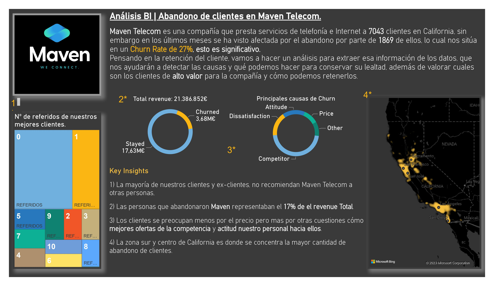
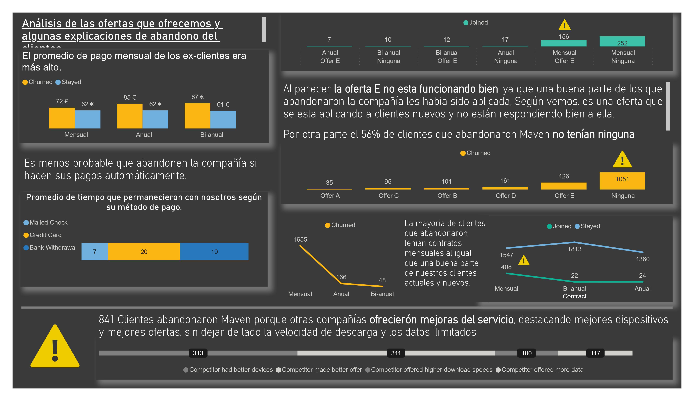
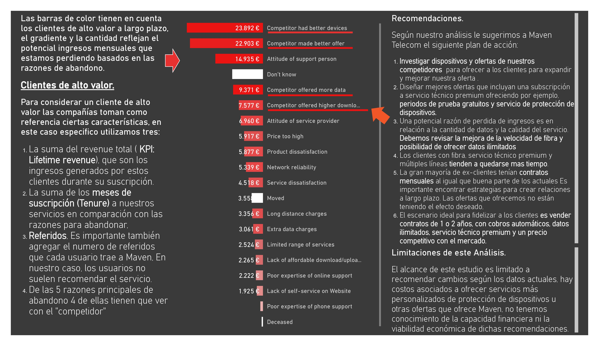

## Maven Telecom | Análisis de abandono de clientes con Pandas, matplotlib y Power BI.

Una de mis cosas favoritas del campo de Businnes Inteligence es convertir los datos en piezas de información que marquen la diferencia para las empresas. El análisis de abandono de clientes (Churn) es ya, un  clásico para aprendices y expertos en el análisis de datos. Gracias a @FavioVazquez y Maven Analytics llegó a mis manos un un dataset de **Churn** de una empresa de telecomunicaciones

Desde el punto de vista del negocio, analizaré el abandono por ingresos totales( Total Revenue), creo que esta es la forma más impactante de visualizarlo. Mi pregunta inevitablementa era: ¿Por qué se van nuestros clientes y comó podemos evitar que siga pasando?. Para esto tenia que segmentar mis clientes según sus caracteristicas y sus necesidades.

En principio realicé un análisis con Pandas con el objetivo de identificar **clientes de alto valor (Alto Lifetime Value)**, luego quería identificar las carácteristicas principales de los **clientes que abandonaron**, la meta es **mejorar la retención de clientes y crear un plan para frenar futuros abandonos.**

Me enfoqué principalmente en el **revenue total**, la cantidad de meses que han estado con nosotros(Tenure) y el numero de referidos(Referals). A partir de ahi, salierón a la luz una serie de caracteristicas como el tipo de contrato que tenian y los servicios a los que estaban suscritos.

Otra cosa que me parecia interesante hacer es dividir el conjunto de personas que abandonaron en dos partes; una para los que se habian ido despues de 12 meses y otra antes de 12 meses, esto me daría una visión más clara de las razones que hacian que nos abandonaran después de 1 año o poco tiempo después de contrata. Destaca que **la mayoria de estas razones estan relacionadas con nuestro competidor.**

Por último cree 3 dashboards con PowerBI, que enfocan de una manera muy visual la historia que quiero contar acerca de los descubrimientos que hice y algunas recomendaciones para Maven Telecom.







```python

```
